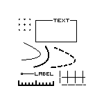

# Scientific Chic

This style uses simple but clear text on plain baclgrounds, and plain diagrams. Thsi style is found in scientific publications and space communication. Can also blend into UI design for data visualization. This is a clean and minimalist design. From NASA's 1975 styleguide:

> The main elements in the design [...] are layout, typography and the logotype/ signature. Other visual motifs are unnecessary... This is an area of design which is best served if the graphics are modern but not elaborate. The main function of a [document] is to convey data and information in a concise and efficient manner.

## Examples

- [Outliers, an RPG](https://far-horizons-co-op.itch.io/outliers)
- [Heaven Will Be Mine](https://store.steampowered.com/app/836450/Heaven_Will_Be_Mine/)
- [Ryoji Ikeda](https://www.ryojiikeda.com/) and [Tomonaga Tokuyama](https://www.tomonagatokuyama.com/) ([video](https://www.youtube.com/watch?v=iCaWqDAq6Pw))
- Instagram user [Drezzdon](https://www.instagram.com/drezzdon/)

## Tenants

    STARK - Lots of margins and space for components. nothing should be cramped
    MONOCHROME - Black and white should be the only colors. Sparing use of R G and B can be used for emphasis.
    CLEAR - Only show what is relevant, and show everything. All uneccesary detail should be removed.

## Fonts

Clean sans-serif for normal text. Should be efficient with space.

Monospace fonts are also common. These can be small like Tokuyama's 5x5 pixel grid, or larger for consoles.

## Other Details

Consistent line weight can go a long way to making this aesthetic look pleasing. I think for documents, some elements can be separated with, say a 5-unit line, while within a single element all parts use a signle weight. This weight should also be fairly small - 1 or 2px on screens may be all that is required.

If some flat image is desired with different colors, consider replacing it with a topographic map - or applying contours of our single line weight instead of color changes.

When rendering graphs onscreen, a fancy computer UI look can be gained with these low-pixelsize stylings.

## Anti-examples

- LaTeX: This style is more pleasing to look at than default LaTeX documents.

